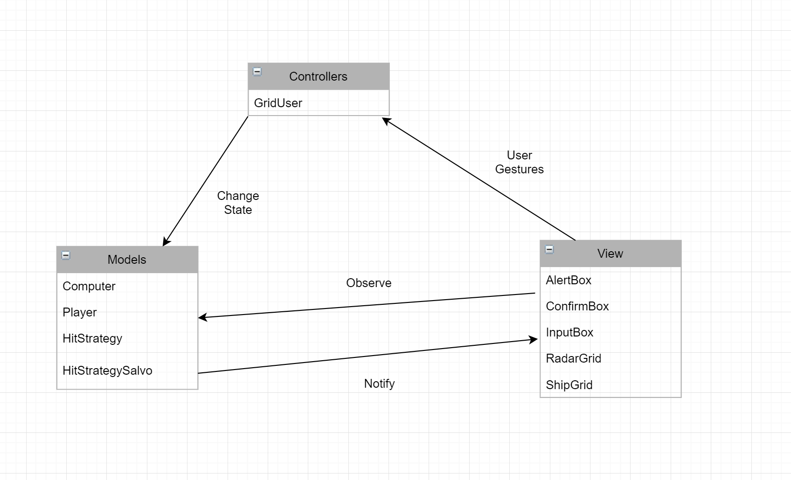

# Project Architecture

## Model-View-Controller (MVC)

The above is the architectural diagram used in this build which shows the implementation of MVC pattern.
The project is break-down in different modules according to their functioning and this is reflected also in the folder structure of our project.

#### Model
* It contains the state and business logic of the Game.
* It notifies the views for changes using Observer Pattern.
* All the user actions are directed here by controller to update the game state.

#### Controller
* It maps user interation to model.
* It handles the user events or actions on View.

#### View
* It renders the game state provided by model.
* It takes user interaction and pass it to controller.
* It updates and renders itself when notified by model for changes.
